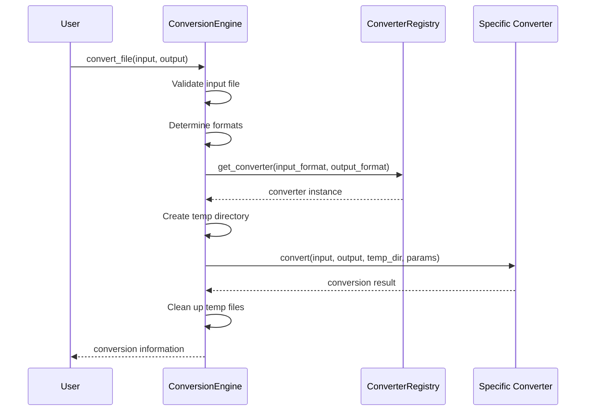

# FileConverter Documentation

Welcome to the FileConverter documentation. This comprehensive guide provides detailed information about the FileConverter system, its features, usage, and development.

## Overview

FileConverter is a comprehensive file conversion utility designed for IT administrators at TSG Fulfillment. It provides a robust and extensible framework for converting files between different formats, with support for a wide range of file types including documents, spreadsheets, images, data exchange formats, and archives.


## Quick Start

### Installation

```bash
# Basic installation
pip install fileconverter

# With GUI support
pip install fileconverter[gui]
```

### Basic Usage

Command Line:
```bash
# Convert a file
fileconverter convert document.docx document.pdf

# Batch conversion
fileconverter batch *.csv --output-dir ./excel_files/ --output-format xlsx
```

Python API:
```python
from fileconverter import ConversionEngine

# Initialize the engine
engine = ConversionEngine()

# Convert a file
result = engine.convert_file("document.docx", "document.pdf")
```

GUI:
```bash
# Launch the GUI
fileconverter-gui
```

## Documentation Contents

### User Documentation

- [**Installation Guide**](./installation.md) - Detailed installation instructions for various platforms
- [**Usage Guide**](./usage.md) - Comprehensive guide on using FileConverter
- [**Configuration**](./configuration.md) - Configuring FileConverter for your needs
- [**Supported Formats**](./formats.md) - List of all supported file formats and conversions
- [**Troubleshooting**](./troubleshooting.md) - Solutions to common issues

### Developer Documentation

- [**API Reference**](./api.md) - Complete API documentation
- [**Architecture Overview**](./architecture.md) - System architecture and design
- [**Developer Guide**](./development.md) - Guide for developers contributing to FileConverter
- [**Adding Converters**](./adding_converters.md) - How to add support for new file formats
- [**Testing Guide**](./testing.md) - Testing procedures and guidelines

## System Architecture

FileConverter is built on a modular architecture consisting of several key components:

1. **Core Engine**: Orchestrates the conversion process
2. **Converter Registry**: Manages available converter plugins
3. **Converter Plugins**: Handle specific format conversions
4. **CLI Module**: Provides command-line interface
5. **GUI Module**: Provides graphical user interface
6. **Configuration System**: Manages user preferences and settings
7. **Utility Modules**: Provide common functionality


## Key Features

- **Comprehensive Format Support**: Convert between various document, spreadsheet, image, data exchange, and archive formats
- **Batch Processing**: Convert multiple files in a single operation with parallel processing for improved performance
- **Custom Conversion Pipelines**: Create and save custom conversion workflows for multi-stage conversions
- **Dual Interfaces**: Choose between command-line interface for automation or GUI for interactive usage
- **Extensible Architecture**: Easily add support for new file formats through the plugin system
- **Robust Error Handling**: Detailed logging and error reporting to facilitate troubleshooting
- **Cross-Platform Compatibility**: Works seamlessly on Windows, macOS, and Linux
- **Python 3.12 Compatible**: Leverages the latest Python features for improved performance and reliability
- **Configurable**: Extensive configuration options through command-line arguments, configuration files, or environment variables

## Conversion Workflow

The typical conversion workflow in FileConverter:



## Extending FileConverter

FileConverter is designed to be easily extensible. You can add support for new file formats by:

1. Creating a new converter class that inherits from `BaseConverter`
2. Implementing the required methods
3. Placing the converter in the appropriate module

For detailed instructions, see the [Adding Converters](./adding_converters.md) guide.

## Contributing

Contributions to FileConverter are welcome! Please see the [Contributing Guide](../CONTRIBUTING.md) for more information on how to contribute to the project.

## License

FileConverter is licensed under the MIT License. See the [LICENSE](../LICENSE) file for details.

## Support

If you encounter any issues or have questions about FileConverter, please:

1. Check the [Troubleshooting Guide](./troubleshooting.md)
2. Search for similar issues in the [GitHub Issues](https://github.com/tsgfulfillment/fileconverter/issues)
3. Create a new issue with detailed information about your problem

For general questions, use the [Discussions](https://github.com/tsgfulfillment/fileconverter/discussions) tab on GitHub.